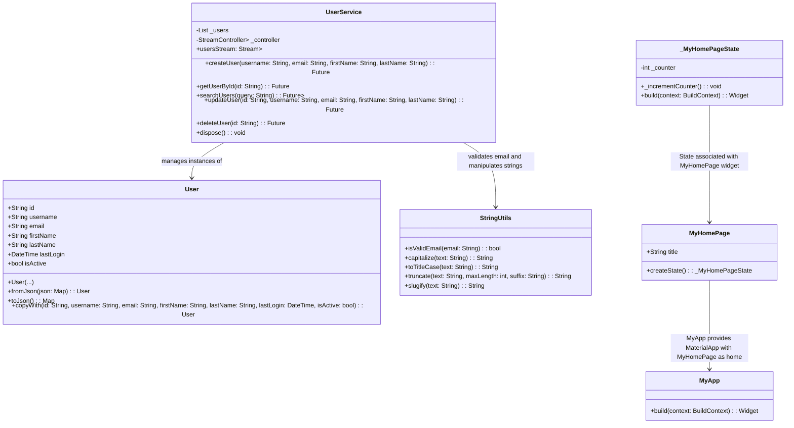
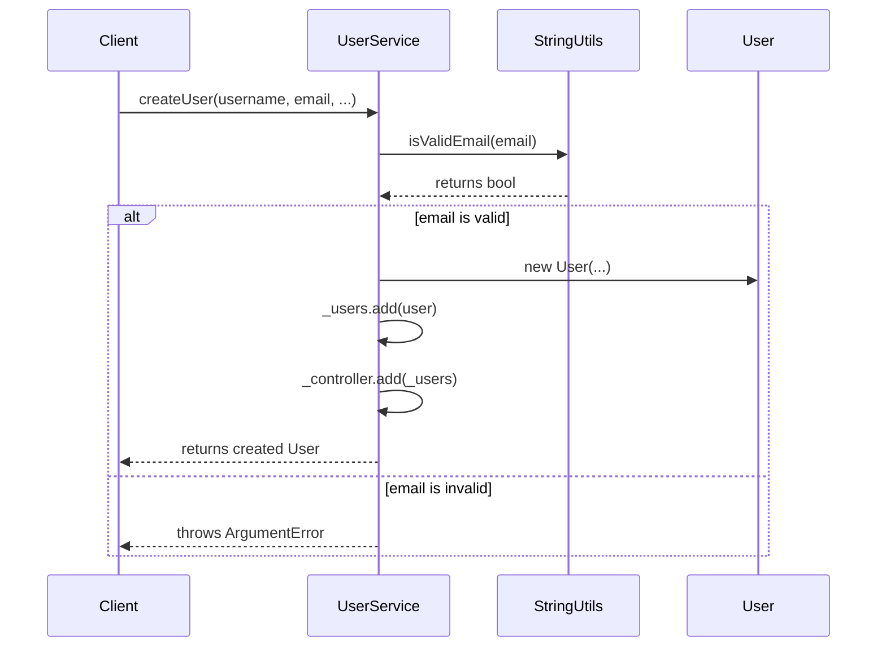
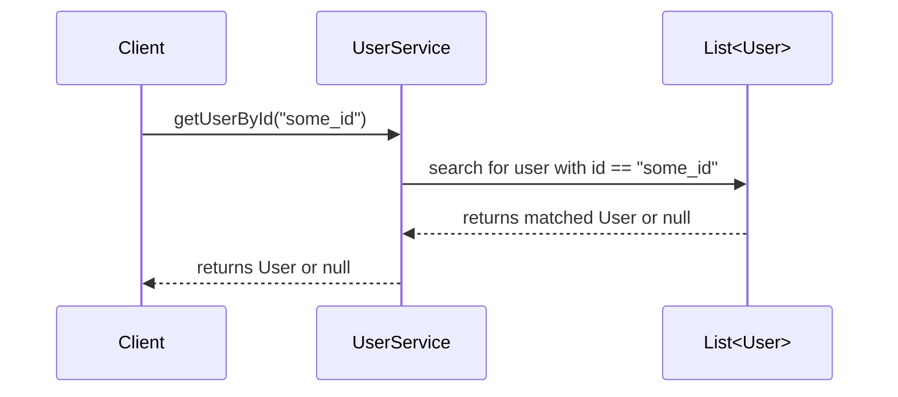
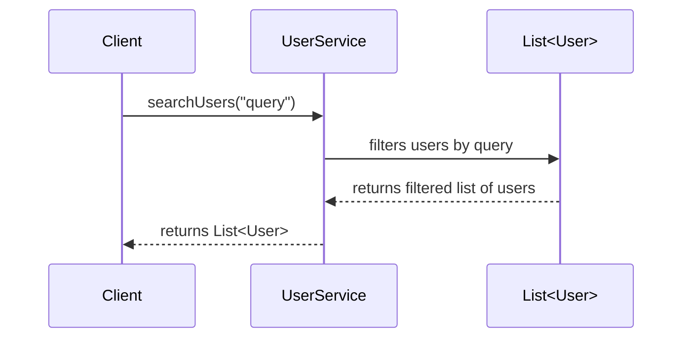
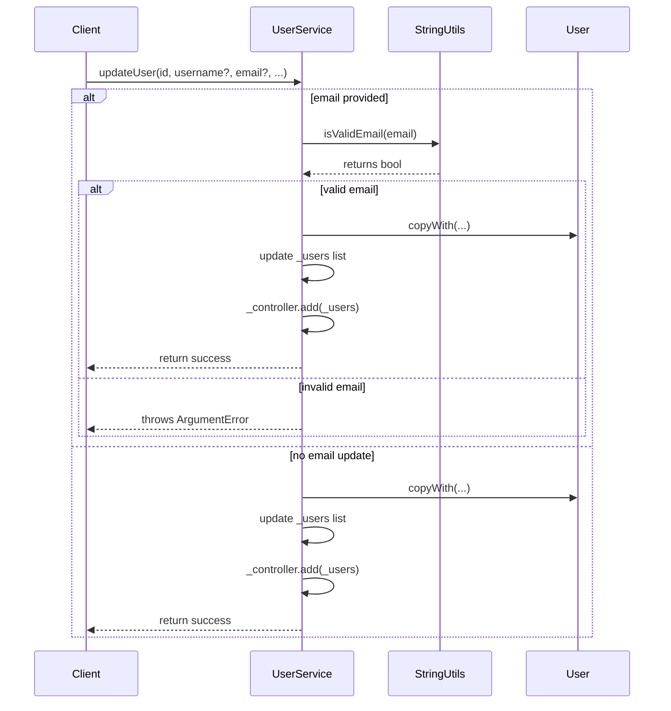
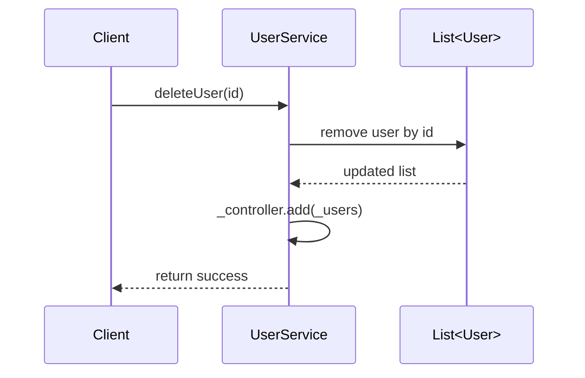
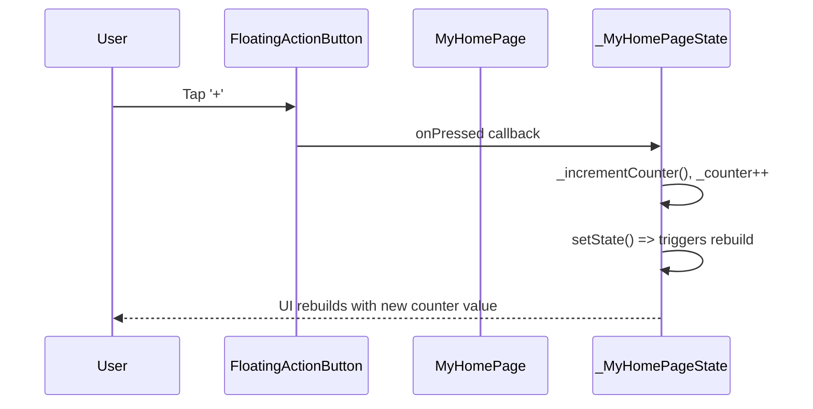

Below is a comprehensive UML-style representation and flow diagrams of the provided Flutter project. We will include class diagrams, sequence diagrams for key operations, and note the folder structure. All UML diagrams are provided in Mermaid syntax.

---

### Folder Structure

```
project_root/
├─ lib/
│  └─ main.dart
└─ test/
   ├─ models/
   │  └─ user.dart
   ├─ services/
   │  └─ user_service.dart
   ├─ utils/
   │  └─ string_utils.dart
   ├─ user_management_test.dart
   └─ widget_test.dart
```

---

### Class Diagram

The main classes involved (not including tests, as tests are typically not included in production UML diagrams):



---

### Sequence Diagrams

#### 1. User Creation Flow

When `createUser` is called on `UserService`, it uses `StringUtils` to validate the email, then creates and returns a new `User`:



---

#### 2. Retrieving a User by ID



---

#### 3. Searching Users



---

#### 4. Updating a User



---

#### 5. Deleting a User



---

#### 6. Main App UI Flow (Counter Increment)

In `MyHomePage`, pressing the FloatingActionButton increments a counter and updates the UI.



---